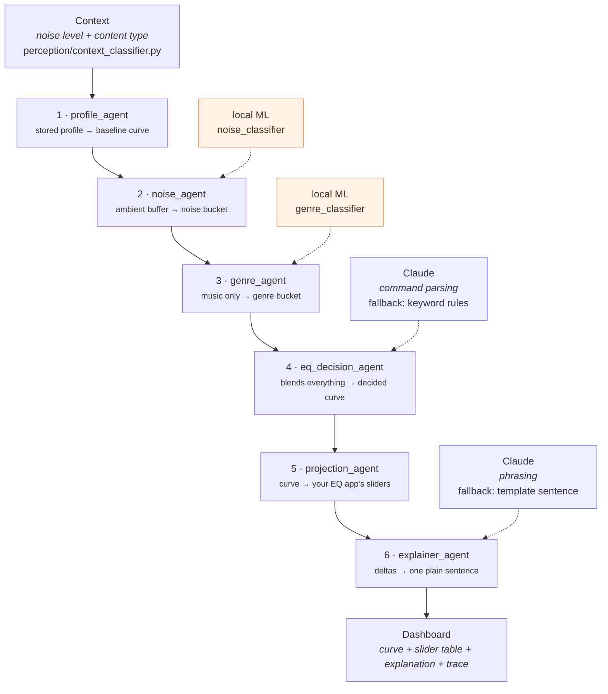

# The agent pipeline, node by node

A sketch of what `agents/graph.py` actually wires together, for the team
slides and for anyone debugging a run. Six LangGraph nodes, strictly
sequential — no branches, no loops. State is one dict (`PipelineState`)
that each node adds keys to.

## Where Claude is and isn't

Only **two of the six nodes** can call an LLM at all. The other four are
fully deterministic, which is why the pipeline still runs end-to-end with
no `ANTHROPIC_API_KEY` set.

| # | Node | Calls Claude? | If the call can't happen |
|---|------|---------------|--------------------------|
| 1 | `profile_agent` | No | — |
| 2 | `noise_agent` | No | No-ops if there's no ambient audio or no trained model |
| 3 | `genre_agent` | No | No-ops unless the content is music *and* a model exists |
| 4 | `eq_decision_agent` | Yes — **only** to parse a typed command into dB deltas | Keyword regexes in `_COMMAND_KEYWORDS` |
| 5 | `projection_agent` | No | No-ops if no EQ app is selected |
| 6 | `explainer_agent` | Yes — to phrase the sentence | Templated sentence from the same deltas |

The context/noise/genre deltas are **never** LLM-decided: they come from
lookup tables (`_NOISE_ADJUSTMENTS`, `dsp/noise_curves.py`,
`dsp/genre_curves.py`), scaled by classifier confidence. Claude can only
influence the curve through a typed command.

## What a run records

Every node is wrapped by `traced()` (`agents/trace.py`), which times it and
captures a one-line summary. The result is `state["agent_trace"]`, which
the dashboard renders as the **Agent trace** panel — one row per node, in
order, marked ✅ ran or ⏭️ skipped.

Each attempted Claude call is recorded as an `LLMCall`
(`agents/llm_client.py`) with its status:

- `ok` — Claude answered; the UI shows the **🤖 Written by Claude** badge.
- `no_api_key` — no key set; the fallback ran and the badge says so.
- `error` — the call failed, or came back unparseable; fallback ran.

Both prompts and the response are visible in the **Claude prompts (dev
view)** expander, with anything matching an API key pattern stripped by
`redact()` before it renders.
